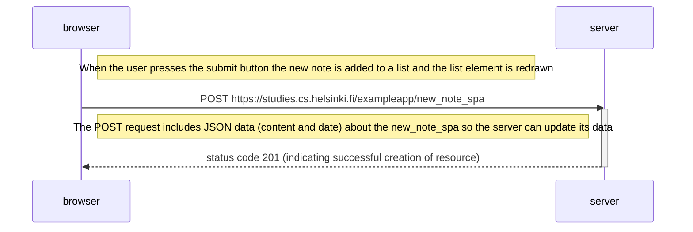

```mermaid
sequenceDiagram
    participant browser
    participant server

    Note right of browser: When the user presses the submit button the new note is added to a list and the list element is redrawn

    browser->>server: POST https://studies.cs.helsinki.fi/exampleapp/new_note_spa
    activate server

    Note right of browser: The POST request includes JSON data (content and date) about the new_note_spa so the server can update its data

    server-->>browser: status code 201 (indicating successful creation of resource)
    deactivate server
```
